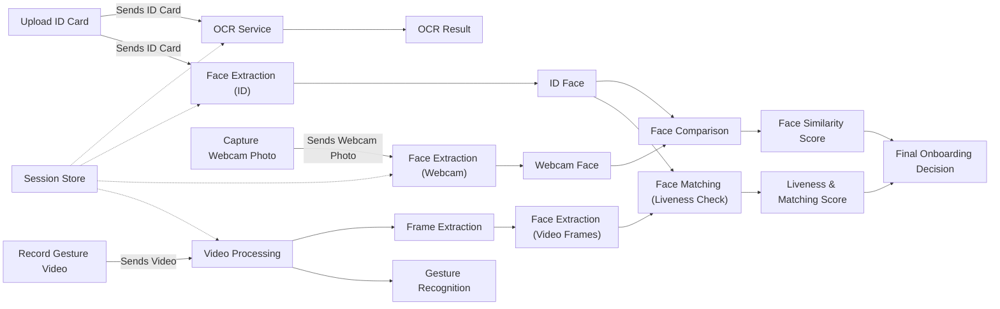

# Customer Service Agent Installation Guide and Overview

## Mermaid Diagrams

```mermaid
%%{init: {'theme': 'default', 'themeVariables': { 'fontSize': '25px', 'nodeSpacing': '50', 'rankSpacing': '50'}}}%%
flowchart LR
    UI1["Upload ID Card"] -->|"Sends ID Card"| A["OCR Service"]
    UI1 -->|"Sends ID Card"| B["Face Extraction (ID)"]
    UI2["Capture Webcam Photo"] -->|"Sends Webcam Photo"| C["Face Extraction (Webcam)"]
    UI3["Record Gesture Video"] -->|"Sends Video"| E["Video Processing"]
    
    A --> OCRResult["OCR Result"]
    B --> IDFace["ID Face"]
    C --> WebcamFace["Webcam Face"]
    
    IDFace --> D["Face Comparison"]
    WebcamFace --> D
    D --> CompareResult["Face Similarity Score"]
    
    E --> F["Frame Extraction"]
    E --> G["Gesture Recognition"]
    F --> H["Face Extraction (Video Frames)"]
    
    IDFace --> I["Face Matching (Liveness Check)"]
    H --> I
    I --> LivenessResult["Liveness & Matching Score"]
    
    CompareResult & LivenessResult --> Final["Final Onboarding Decision"]
    
    S["Session Store"] -.-> A
    S -.-> B
    S -.-> C
    S -.-> E

```

## Grids and Cards